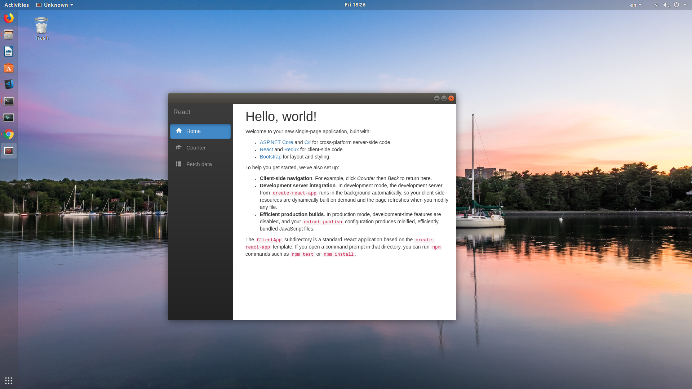

# CefAdapter.Net

Create cross-platform (Windows and Linux) HTML5 UI for your .NET projects.

## Requirements

.NET Core SDK 2.1+ (https://www.microsoft.com/net/learn/get-started/windows)

For the Angular and React samples Node JS (https://nodejs.org/en/) is also required.

## Building and running the Angular sample

To run the Angular sample application you must first restore the Angular NPM dependencies.

Open a terminal at **Samples/Angular/ClientApp** and execute:
`npm install`

After this step you can build and run the project using:
`dotnet run`

## Building and running the React sample

To run the Angular sample application you must first restore the Angular NPM dependencies.

Open a terminal at **Samples/React/ClientApp** and execute:
`npm install`

After this step you can build and run the project using:
`dotnet run`

